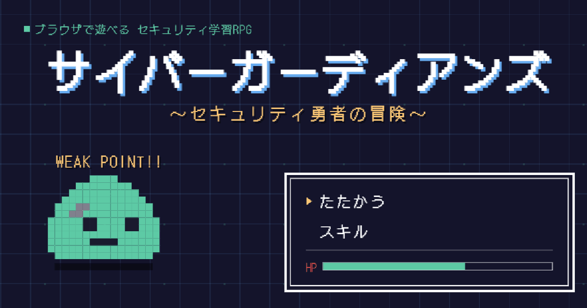

# サイバーガーディアンズ 〜セキュリティ勇者の冒険〜

  
    
  <b>アプリURL</b> : <a href="https://cyber-guardians-five.vercel.app/">サイバーガーディアンズ 〜セキュリティ勇者の冒険〜</a>

---

**「戦うたびに、セキュリティに強くなる」**

ITセキュリティの知識をターン制RPGのバトルシステムに変換した、ブラウザで遊べる学習ゲームです。
敵は実在するサイバー攻撃、プレイヤーのスキルは実在するセキュリティ対策に対応しており、
**遊び方を覚えること = セキュリティ対策を覚えること** になるのが最大の特徴です。

- 1バトル2〜3分、全体で20〜30分のショートRPG
- 対象: IT初学者(セキュリティ研修の入口として)
- インストール不要、URLひとつで遊べる静的サイト(サーバー・DB不使用)

## スクリーンショット

  
    
  
    
  

## 開発背景

今回このアプリを作成するにいたった経緯ですが、セキュリティ学習を体系的に学ぶことが難しいと感じていました。実際に勉強をするとなると、徳丸　浩　『安全なwebアプリケーションの作り方』(SBクリエイティブ)といった書籍や情報セキュリティマネジメントの学習をするといった最初の一歩が重いものとなっていると考えます。また、前回のRUNTEQ内でのミニアプリWeeKで制作したアプリ(**CSRFシミュレーター**: https://csrf-playground.vercel.app/) が、セキュリティの学習を進めていく中で、CSRFが実際にどんなことが起こっているのかを理解するために開発したのですが、理解という観点からはよかったのですが、ユーザーのワクワクするといった楽しさはないアプリだとユーザーのコメントから判断しました。そこで、もっとユーザーが楽しく気軽にセキュリティ学習をするためにはどうしたらいいのかと考えていた時に、バグハンター2(https://www.freem.ne.jp/win/game/30836) というゲームに出会いました。このゲームは、仙塲　大也　『良いコード／悪いコードで学ぶ設計入門』(技術評論社)の副次的な教材だとされていて、RPGゲームをモチーフに、設計に関する内容に関してゲームを通して学んでいきます。この設計に関する、内容をゲームに落とし込んで楽しく学ぶという点に共感して、ゲーム形式を選びました。また、このゲームは主に設計に関する内容にフォーカスを置いているので、今回の私のアプリではセキュリティにフォーカスを置いて作成しました。

## 今回の焦点

セキュリティを体系的に学習するとは言え、実際にどのくらいITに関する知識を持ったユーザーがプレイするのかは分かりません。そこで、ショルダーハッキングやワクチンスキャンなど、ITに関わる全般に方に覚えてもらいたいことは、メインストーリーに、クロスサイトスクリプティングやCSRF攻撃などの開発者側で対策する内容についてはEXストーリー(今後実装予定)に分け、どんなユーザーでも楽しく遊び、学べるようにしたいと考えました。

## 遊び方

### コマンド

  

| コマンド | 効果 |
|---|---|
| たたかう | 通常攻撃 |
| スキル | セキュリティ対策で攻撃・防御(リソースを消費) |
| ぼうぎょ | 被ダメージ半減+リソース回復 |

### 弱点対策システム(コアメカニクス)

敵ごとに「正しいセキュリティ対策」が弱点になっています。

- **正解のスキル** → WEAK POINT演出+大ダメージ
- **不正解のスキル** → ほとんど効かず、相棒のサポートAI「クローンコード」がヒントをくれる
- **負けても大丈夫** → ヒントをもらって即リトライ(「負けて覚える」のも対策のうち)

敵を倒すと「セキュリティ手帳」に記録され、その攻撃の正体と現実での対策をクローンコードが解説します。

### ステータスの読み替え

| RPGの用語 | 本作での意味   |
| --------- | -------------- |
| HP        | システム稼働率 |
| MP        | リソース       |

※スキルを使用するとMPが消費されます。

## 収録している敵と対策(開発中・順次追加)

| 敵キャラ                   | モチーフの攻撃     | 弱点(= 正しい対策)                   |
| -------------------------- | ------------------ | ------------------------------------ |
| ワームスライム             | ワーム型マルウェア | ワクチンスキャン(ウイルス対策ソフト) |
| フィッシング・アングラー   | フィッシング詐欺   | URLかくにん(リンク先・送り主の確認)  |
| ブルートフォース・ゴーレム | 総当たり攻撃       | 二要素認証(2FA/MFA)                  |

## 技術構成

| 項目           | 採用技術                         |
| -------------- | -------------------------------- |
| フレームワーク | Vite + React + TypeScript        |
| サウンド       | Howler.js                        |
| セーブ         | localStorage(サーバー・DB不使用) |
| デプロイ       | Vercel                           |

## 教育コンテンツの方針

- セキュリティ解説は IPA・総務省等の公的機関の情報を典拠とします
- 「これで完全に防げる」といった言い切り表現は使いません(多層防御の考え方と矛盾させない)
- 攻撃の再現手順は扱いません。学べるのは「見分け方と守り方」のみです

## 教育コンテンツの方針

今後の予定に関して

- 各ボスを撃破後に記録されるセキュリティの記録を後からでも見れるようにする 
- アイテムの役割を明確にして、実装する                              
- 開発側に関するセキュリティの内容のストーリーを実装する
- 各ボスを撃破後に、もらえる達成報酬を設定する
- ゲームの中断ボタンを実装する

## クレジット

- 音楽・効果音:[魔王魂](https://maou.audio/)

使用素材の一覧と出所は [ASSETS.md](ASSETS.md) に記録しています。
